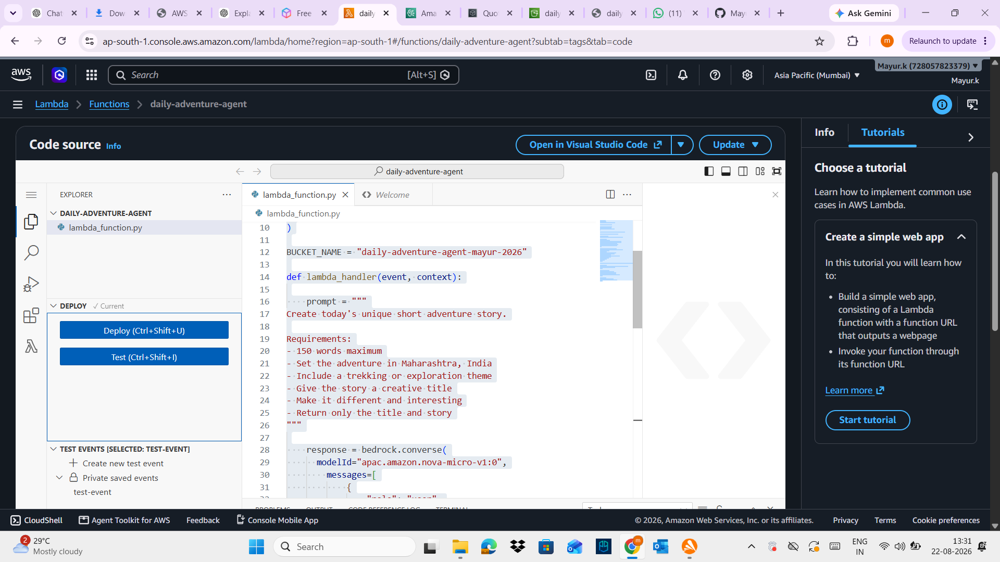
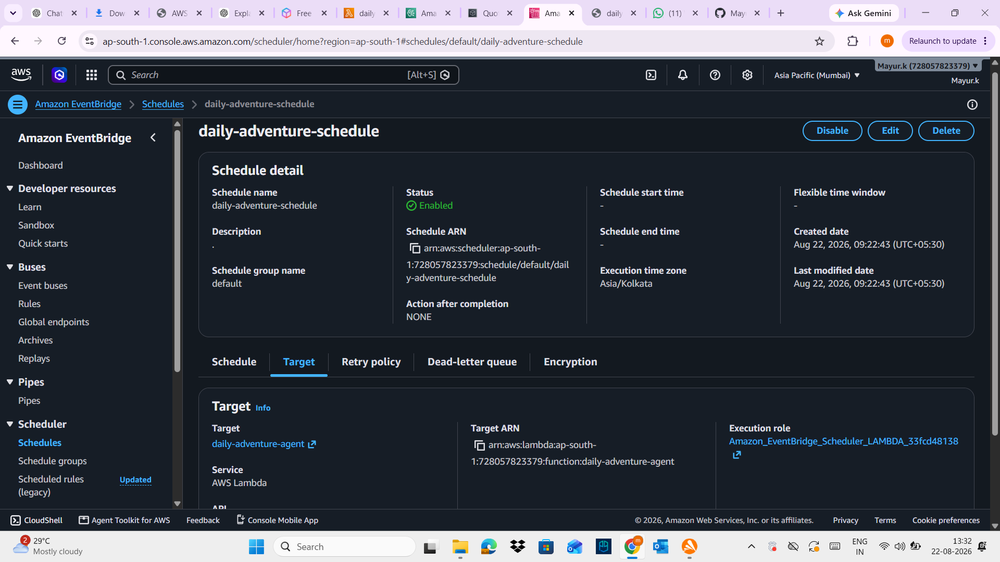
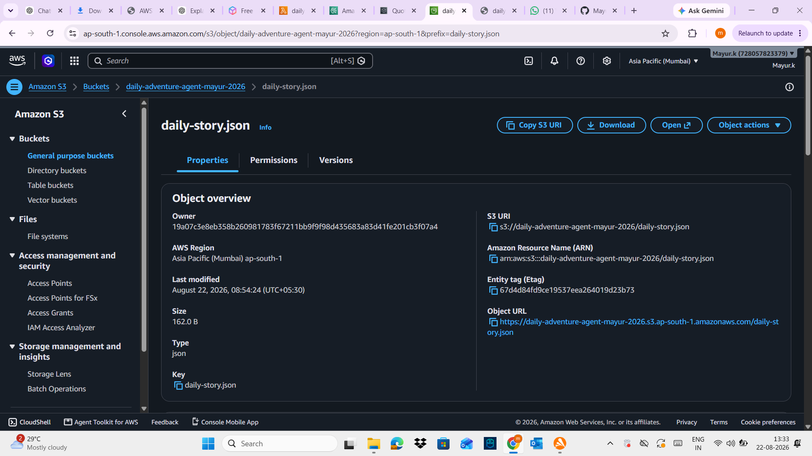
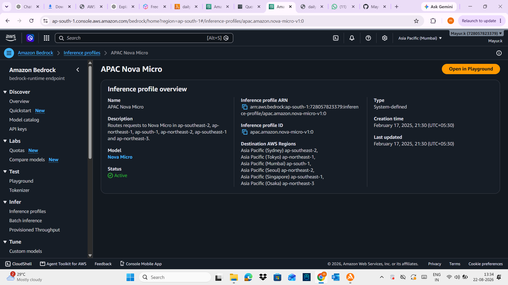

# 🏔️ TrailTales — Your Daily AI Adventure

> An always-on AI creative agent that automatically creates a new adventure story every day using AWS.

## 🚀 Vision

TrailTales is an always-on AI creative application designed to create a new adventure story automatically every day.

The idea is simple: instead of requiring a user to open an application and manually ask an AI to generate something creative, TrailTales runs automatically in the background.

The agent generates short trekking and exploration-themed stories inspired by Maharashtra, India. The generated content is stored in Amazon S3, creating a growing collection of daily adventures.

The project demonstrates how generative AI and serverless AWS services can be combined to build an automated creative application.

## 💡 How It Works

TrailTales follows an event-driven architecture:

1. Amazon EventBridge Scheduler triggers the application once every day.
2. AWS Lambda receives the scheduled event.
3. Lambda prepares a creative prompt for the AI model.
4. Amazon Bedrock invokes Amazon Nova Micro through an APAC inference profile.
5. The generated story is processed by Lambda.
6. The story is stored as a JSON document in Amazon S3.

## 🏗️ Architecture

TrailTales follows an event-driven serverless architecture.

**EventBridge Scheduler**

↓

**AWS Lambda — Daily Adventure Agent**

↓

**Amazon Bedrock — Nova Micro**

↓

**Amazon S3 — daily-story.json**

### Workflow

1. EventBridge Scheduler triggers the Lambda function once every day.
2. Lambda prepares the creative prompt.
3. Lambda invokes Amazon Bedrock using the Nova Micro inference profile.
4. Nova Micro generates the adventure story.
5. Lambda stores the result in Amazon S3 as `daily-story.json`.

## ☁️ AWS Services Used

### Amazon Bedrock

Amazon Bedrock provides access to the generative AI model used by TrailTales.

### Amazon Nova Micro

Nova Micro is used to generate short text-based adventure stories.

### AWS Lambda

Lambda contains the application logic. It prepares the prompt, invokes Bedrock, processes the response, and stores the generated content.

### Amazon S3

S3 stores the generated stories as JSON files.

### Amazon EventBridge Scheduler

EventBridge Scheduler automatically invokes Lambda every day, making TrailTales an always-on creative agent.

### AWS IAM

IAM provides the permissions required for Lambda to interact with Bedrock and S3.

## 🛠️ How I Built It

I started by creating an Amazon S3 bucket for storing the generated creative content.

Next, I created an AWS Lambda function called `daily-adventure-agent`. The first milestone was getting Lambda to successfully write a JSON document to S3. This allowed me to verify the serverless storage pipeline before integrating generative AI.

I then integrated Amazon Bedrock into Lambda. During development, I discovered that the Nova model needed to be invoked through an appropriate inference profile from my AWS Region. I configured the APAC Nova inference profile and updated the Lambda function accordingly.

I also encountered a Lambda timeout because the default timeout was only three seconds. I increased the Lambda timeout to 60 seconds to allow sufficient time for the Bedrock request.

During testing, my AWS account reached its Bedrock daily token quota. I therefore explored Amazon Nova Micro as a lightweight alternative and submitted an AWS Service Quotas request for additional token capacity.

Finally, I created an Amazon EventBridge Scheduler that automatically invokes the Lambda function every day.

## 🧩 Challenges

One of the biggest challenges was understanding the difference between a foundation model ID and an inference profile.

Another challenge was the Lambda timeout. AI model requests can take longer than a basic Lambda operation, so the default three-second timeout was not sufficient.

The most significant challenge was the Bedrock account-level token quota. This highlighted an important lesson: successfully building an AI application requires understanding not only the code, but also AWS quotas, regions, permissions, inference profiles, and service limitations.

## 📚 What I Learned

This project helped me gain practical experience with event-driven serverless architecture and generative AI on AWS.

I learned how to:

- Integrate AWS Lambda with Amazon Bedrock
- Work with Amazon Nova inference profiles
- Configure IAM permissions
- Store application output in Amazon S3
- Automate Lambda execution using EventBridge Scheduler
- Troubleshoot Bedrock validation and throttling errors
- Design an event-driven AI workflow

The biggest lesson was that building an AI application involves much more than simply calling a model. Infrastructure, security, region availability, quotas, timeouts, and automation all play an important role.

## 🔮 Future Improvements

Future versions of TrailTales could include:

- A web interface for reading daily stories
- Weather-based story generation
- User-submitted adventure prompts
- Community prompt remixing
- Multiple creative writing styles
- AI-generated illustrations
- Story archives and search
- Personalized adventure themes

## 📸 Project Evidence

### AWS Lambda

The Lambda function contains the core TrailTales agent logic and integrates with Amazon Bedrock.

### EventBridge Scheduler

EventBridge Scheduler automatically triggers the TrailTales Lambda function on a daily schedule.

### Amazon S3

Generated adventure content is stored in Amazon S3 as daily-story.json.

### Amazon Bedrock — Nova Micro

TrailTales uses Amazon Nova Micro through an APAC inference profile.

## 📊 Project Status

- ✅ AWS Lambda configured
- ✅ Amazon S3 storage configured
- ✅ Amazon EventBridge Scheduler configured
- ✅ Amazon Bedrock Nova Micro inference profile configured
- ✅ IAM permissions configured
- ✅ Nova Micro successfully generated an adventure story and stored it in Amazon S3
## 🔗 Repository

GitHub: https://github.com/Mayur-Builds/trailtales-ai-agent

## 🏷️ Challenge

Built for the AWS Builder Center **Set Your Creative App Free Weekend Challenge**.

#agents
